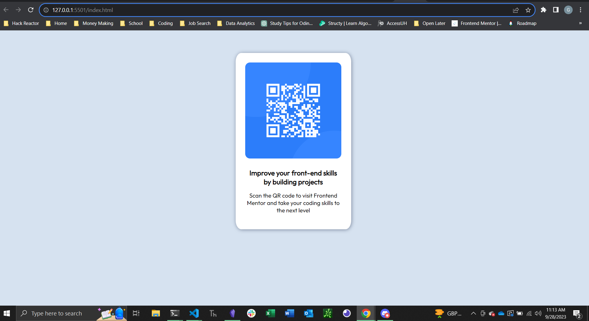

# Frontend Mentor - QR code component solution

This is a solution to the [QR code component challenge on Frontend Mentor](https://www.frontendmentor.io/challenges/qr-code-component-iux_sIO_H). Frontend Mentor challenges help you improve your coding skills by building realistic projects.

## Table of contents

- [Overview](#overview)
  - [Screenshot](#screenshot)
  - [Links](#links)
- [My process](#my-process)
  - [Built with](#built-with)
  - [What I learned](#what-i-learned)
  - [Continued development](#continued-development)
  - [Useful resources](#useful-resources)
- [Author](#author)
- [Acknowledgments](#acknowledgments)

**Note: Delete this note and update the table of contents based on what sections you keep.**

## Overview

### Screenshot

### Links

- Solution URL: [Add solution URL here](https://github.com/LyttleGC/qr-code-component)
- Live Site URL: [Add live site URL here](https://lyttlegc.github.io/qr-code-component/)

## My process
My approach was to see the example image and then build it by sight using the style guide.

### Built with

- Semantic HTML5 markup
- CSS custom properties
- Flexbox

### What I learned

I learned that I need to practice and study more as there are things that theoretically sound simple to do, but I couldn't figure out how to do them. I'm glad I found this website to start practicing and learnign while actually creating.

### Continued development

I want to definitely keep practicing making beautiful styles for web pages. I'm excited and thrilled to become a front end developer in the future.

## Author

- Frontend Mentor - [@LyttleGC](https://www.frontendmentor.io/profile/LyttleGC)
